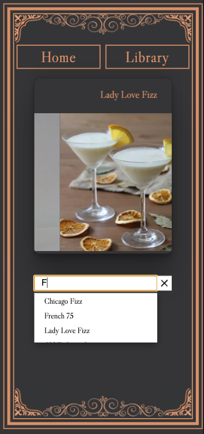
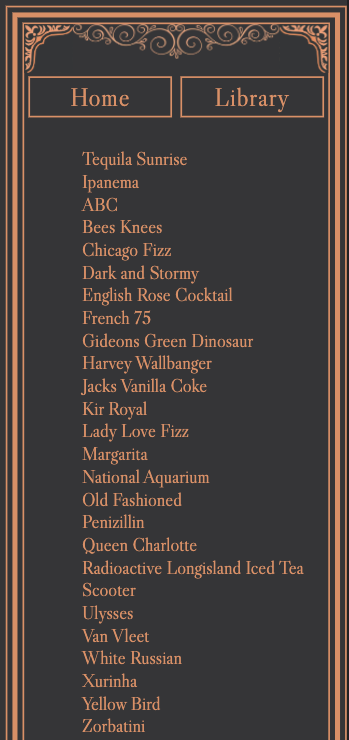
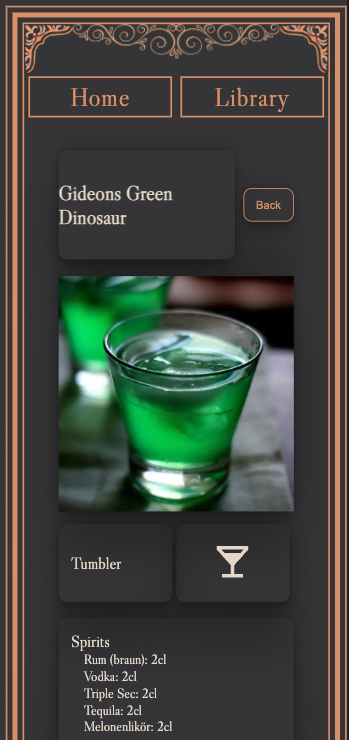

## Introduction

**This is a capstone project for [neuefische](https://www.neuefische.de/) web development bootcamp.**

## Mixed and Between

Planning an evening with your friends at home? The next birthday party is coming?
Then you will need some drinks to serve.

## App Impressions

     
     

## TechStack

- React
- React Hooks
- React Router
- Express
- Styled Components
- Jest
- Node.js
- MongoDB with mongoose

## How to Run the App

- clone this repository
- install all npm dependencies by using `npm install`
- to run the app in development mode `npm run dev`, then open http://localhost:3000 to view it in the browser
  to create a build ready for deploying: `npm run build`
